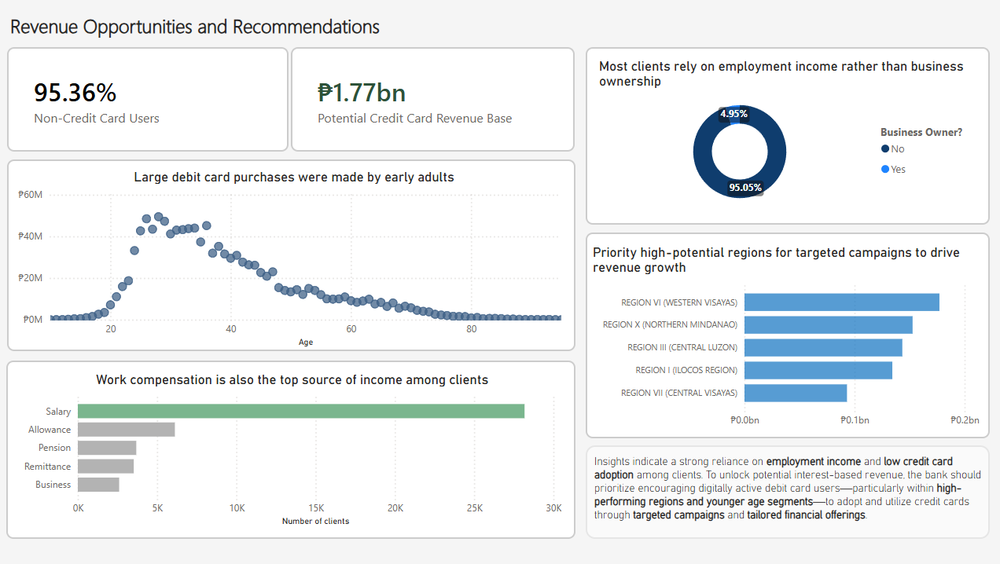
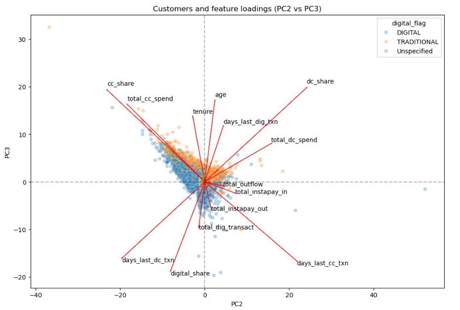
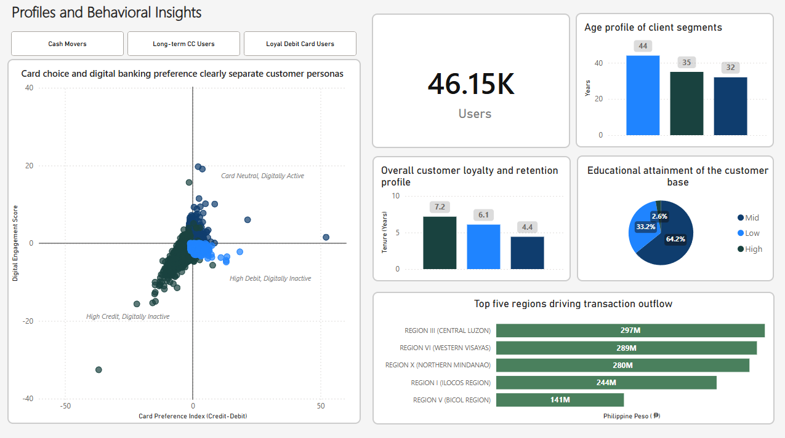

# Banking Cross-Sell Strategy & Segmentation Dashboard

  

## 📊 Executive Summary
In retail banking, transactions made via cash and debit cards are low-margin, cost-center activities, whereas credit card transactions generate high-margin revenue through interchange fees and interest. 

This project analyzes customer transaction data to identify high-liquidity users currently utilizing low-margin channels. By applying **Principal Component Analysis (PCA)** to segment behavioral profiles, we designed a targeted cross-sell strategy to upgrade debit-heavy users to credit products. 

**Key Finding:** Identified **₱1.77 Billion** in addressable transaction volume across 44,000 non-credit card users. The data indicates that targeted lifestyle/rewards credit card campaigns aimed at the 25–35 "Young Professional" demographic yield the highest conversion opportunity.

---

## 🧠 Methodology: The PCA Segmentation Engine

Instead of relying on arbitrary manual thresholds to group customers, this project utilizes dimensionality reduction (PCA) to mathematically identify natural behavioral clusters. 

  

* **Data Compression:** Condensed 14+ complex behavioral variables (spend volume, digital share, transaction frequency) into two core Principal Components.
* **Behavioral Indexing:** Translated PC loadings into two functional metrics: a **Card Preference Index** (Credit vs. Debit) and a **Digital Engagement Score**.
* **Heuristic Tagging:** Plotted customers on these newly created axes to define actionable personas (e.g., *Loyal Debit Card Users*, *Card Neutral, Digitally Active*).

---

## 🎯 The Cross-Sell Playbook (Dashboard Walkthrough)

The Power BI dashboard translates the PCA model into a strategic deployment tool for regional sales and marketing teams.

### 1. Defining the Core Personas

*Analyzes the entire customer base, confirming that our most profitable segment (Long-term CC Users) is also our smallest, highlighting the massive cross-sell opportunity.*

### 2. Targeting the "Whales" & The Demographic Hook
*(Refer to the hero image at the top of the document).*
Once the target audience was isolated (excluding current CC users), demographic analysis revealed the optimal marketing approach:
* **The Age Peak:** The vast majority of the ₱1.77B debit volume is driven by customers aged **25 to 35**.
* **The Income Profile:** 95% of targets are **non-business owners**, with their primary income source being standard **Salary**.
* **The Strategic Pivot:** Marketing campaigns should abandon corporate credit line messaging and focus exclusively on consumer perks (zero annual fees, dining/travel cashback) tailored to young salaried professionals.

---

## 🛠️ Tech Stack & Tools

* **Data Processing & EDA:** `Python`, `Pandas`, `NumPy`
* **Machine Learning / Statistics:** `Scikit-Learn` (PCA, Standard Scaler)
* **Visualization & BI:** `Power BI`, `DAX`, `Matplotlib/Seaborn` (for initial EDA)

---

## 📁 Repository Structure

* `Notebooks/`: Contains the Jupyter notebooks detailing the data cleaning pipeline, exploratory data analysis (EDA), and PCA math.
* `Dashboard/`: Contains the full strategic narrative report detailing the business case and brief recommendations.

---
> **Note on Project:** A narrative report on the entire data preprocessing and analysis process will be added to this repository soon!!
> **Note on Data Privacy:** The dashboard visualizations displayed above utilize anonymized and mathematically randomized data to protect proprietary financial intelligence while demonstrating the analytical structure and business logic.
